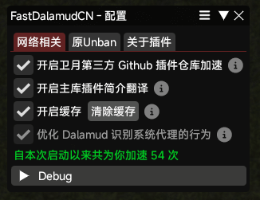

# FastDalamudCN

Fast Dalamud CN 致力于为国内用户提供卫月第三方库的加载与下载加速服务，并提供部分主库插件简介的中文翻译，优化使用体验。

## 使用方法

请前往此 Repo 获取仓库地址 [https://github.com/decorwdyun/DalamudPlugins](https://github.com/decorwdyun/DalamudPlugins)

## 插件屏幕截图

---

❓ 关于插件更名？ Why Was the Plugin Renamed?

  
本插件原名为 **FuckDalamudCN**。当时，由 OtterCorp 维护的 Dalamud CN 分支引入了与上游不一致的代码，包括禁用部分插件以及采集用户信息[EventTracking.cs#L54-L69](https://github.com/ottercorp/Dalamud/blob/fd4b1fbad65d495e75d4b306b33c613e2ee01038/Dalamud/Support/EventTracking.cs#L54-L69)。

目前 OtterCorp 已在 [Commit 6b032f6](https://github.com/ottercorp/Dalamud/commit/6b032f62736a05d9f07bc256644b6054937cfc4f#diff-228c3da520a379ccd2ab9e0a184f6e96dcbf66d4473bb8d7e78773c507d86205) 中已移除了上述争议代码，本插件现正式更名为 **FastDalamudCN**，回归纯粹的工具属性。

**注意：**
由于插件机制限制，`InternalName`（内部名称）无法修改，因此插件的配置文件和文件夹名称仍将保留旧名字。

---

**Regarding the Name Change:**
This plugin was formerly known as **FuckDalamudCN**. Previously, the Dalamud CN fork maintained by OtterCorp introduced code diverging from upstream, which included disabling certain plugins and collecting user information (see [EventTracking.cs#L54-L69](https://github.com/ottercorp/Dalamud/blob/fd4b1fbad65d495e75d4b306b33c613e2ee01038/Dalamud/Support/EventTracking.cs#L54-L69)).

Given that OtterCorp has removed the controversial code in [Commit 6b032f6](https://github.com/ottercorp/Dalamud/commit/6b032f62736a05d9f07bc256644b6054937cfc4f#diff-228c3da520a379ccd2ab9e0a184f6e96dcbf66d4473bb8d7e78773c507d86205), this plugin is now officially renamed to **FastDalamudCN**, returning to its core utility.

**Note:**
Due to plugin mechanism limitations, the `InternalName` cannot be changed; therefore, configuration files and folder names will retain the old name. **However**, the display name in the plugin list has been updated to **FastDalamudCN**.

## License

此项目基于 GPL-3.0 协议开源，详情请参阅 [LICENSE](LICENSE) 文件。
